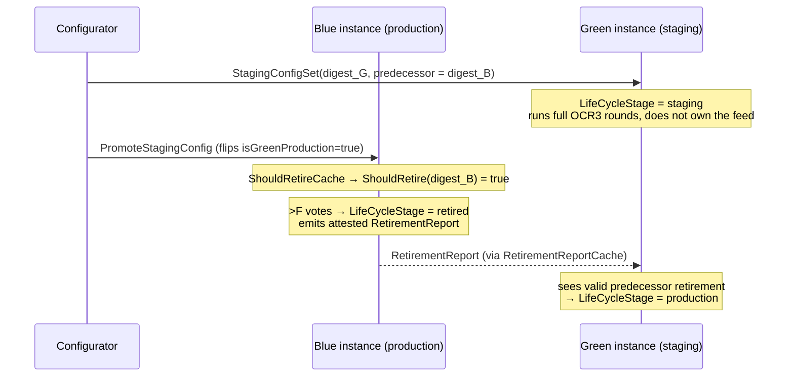

# LLO Bootstrap & Blue/Green Deep Dive

> How bootstrapping actually works for LLO, what changes under Blue/Green, what
> `SetStagingConfig` / `SetProductionConfig` / `PromoteStagingConfig` do to each moving part,
> and — critically — **which signals can and cannot tell you whether nodes are peered on a
> *specific* config digest**.
>
> Companion to `llo-protocol-deep-dive.md` (rounds/outcomes/reports) and
> `chainlink/core/notes/LLO-Bootstrap-Connectivity-Troubleshooting.md` (incident runbook).
>
> All line references are against the local `llo-stack` workspace
> (`libocr/`, `chainlink-evm/`, `chainlink/`, `chainlink-data-streams/`) and
> `chainlink-evm@v0.3.4-0.20260623170329-4577ef4ba0ae` for `pkg/relay`.

---

## Table of Contents

1. [The one-paragraph mental model](#1-the-one-paragraph-mental-model)
2. [What a bootstrap node is (and is not)](#2-what-a-bootstrap-node-is-and-is-not)
3. [The four P2P objects you must keep separate](#3-the-four-p2p-objects-you-must-keep-separate)
4. [Wiring: job spec → libocr](#4-wiring-job-spec--libocr)
5. [Bootstrap startup sequence](#5-bootstrap-startup-sequence)
6. [Blue/Green: slots, not colors](#6-bluegreen-slots-not-colors)
7. [Event-by-event walkthrough](#7-event-by-event-walkthrough)
8. [The Blue-only bootstrap hack (MERC-6839)](#8-the-blue-only-bootstrap-hack-merc-6839)
9. [Answers to the specific questions](#9-answers-to-the-specific-questions)
10. [How to check if a bootstrap job is working](#10-how-to-check-if-a-bootstrap-job-is-working)
11. [Blue/Green rollout runbook (SetStagingConfig)](#11-bluegreen-rollout-runbook-setstagingconfig)
12. [Signal reference: logs, metrics, code map](#12-signal-reference-logs-metrics-code-map)

---

## 1. The one-paragraph mental model

A bootstrap node is a **rendezvous point for peer address discovery**, nothing else. It reads
the DON's on-chain config, extracts the *oracle peer ID set*, registers that set as a
"group" with the discovery layer, and then relays signed address announcements between
members of that group. It never sees stream data, never runs the LLO plugin, never
transmits, and — contrary to a common belief — **never pushes OCR config to oracles**.
Oracles read config from the chain themselves. Under Blue/Green, an oracle node runs **two
independent OCR3 instances** (Blue and Green), each with its own config digest, its own
discovery group and its own message streams — but they share one TCP connection per peer and
one process-wide set of P2P metrics. That sharing is the root of nearly every
"is staging actually peered?" confusion.

---

## 2. What a bootstrap node is (and is not)

libocr states the role outright:

```go
// Bootstrapper connects to a particular feed and listens for config changes,
// but does not participate in the protocol. It merely acts as a bootstrap node
// for peer discovery.
```
`libocr/offchainreporting2plus/bootstrapper.go:35`

`bootstrapperV2` has **no message loop at all** — its entire body is a constructor that logs
`BootstrapperV2: Initialized`, a `Start()` that logs `BootstrapperV2: Started listening`, and
a `Close()` that releases the group registration
(`libocr/networking/bootstrapper_v2.go:44-80`). All actual work happened in
`concretePeerV2.register()` (`libocr/networking/peer_v2.go:157`), which calls
`discoverer.AddGroup(configDigest, oracles, bootstrappers)`.

| Bootstrap node **does** | Bootstrap node **does not** |
|---|---|
| Read configurator events via the log poller DB | Call the RPC directly per poll |
| Register the oracle peer ID set as a discovery group | Run OCR3 consensus, observations, or reports |
| Accept inbound ragep2p connections from those peer IDs | Accept connections from peers outside the group |
| Relay signed announcements (`ragedisco/v1`) between group members | Send OCR config to oracles over P2P |
| Answer `rageping` probes | Transmit reports anywhere |

**Correction to a widespread claim:** you will see docs/AI answers describing bootstrap as a
"config server" that "broadcasts config to oracle peers over P2P". It doesn't. Every oracle
has its own `ContractConfigTracker` polling the same configurator contract
(`chainlink/core/services/llo/delegate.go:175`). Bootstrap's config read exists *only* to
learn which peer IDs are allowed in the group. This matters operationally: a bootstrap stuck
on a stale digest does not give oracles stale config — it gives them a **wrong allowlist**,
which manifests as `Received incoming connection from an unknown peer, closing`
(`libocr/ragep2p/ragep2p.go:769`).

---

## 3. The four P2P objects you must keep separate

Almost every Blue/Green observability trap comes from conflating these.

```
┌──────────────────────────────────────────────────────────────────────────┐
│ 1. CONNECTION   (ragep2p)   — one TCP/TLS conn per (peer_id, remote)     │
│    Shared by every config digest. Metrics: ragep2p_peer_conn_*           │
├──────────────────────────────────────────────────────────────────────────┤
│ 2. GROUP        (ragedisco) — one per configDigest                       │
│    Defines: who we accept, whose announcements we relay to whom          │
│    Registered by AddGroup(); metrics are UNIONS across all groups        │
├──────────────────────────────────────────────────────────────────────────┤
│ 3. ANNOUNCEMENT (ragedisco) — one per peer, signed, counter-versioned    │
│    Process-wide map bestAnnouncement[peerID]. NOT per digest.            │
├──────────────────────────────────────────────────────────────────────────┤
│ 4. STREAM       (ragep2p)   — per (peer, streamName)                     │
│    "ragedisco/v1", "ping-pong-…", and "ocr/<configDigest>"               │
│    ← THE ONLY PER-DIGEST OBJECT. And it has no Prometheus metrics.       │
└──────────────────────────────────────────────────────────────────────────┘
```

Stream naming: `fmt.Sprintf("ocr/%s", cd)` (`libocr/networking/ocr_endpoint_v2.go:145`); OCR3.1
adds a second stream `ocr/<cd>/priority=low`
(`libocr/networking/ocr_endpoint_v3.go:596`).

### 3.1 Group semantics (the rules that decide discovery)

From `libocr/networking/ragedisco/discovery_protocol.go`:

| Rule | Code | Consequence |
|---|---|---|
| An announcement from peer B is **rejected** unless B is an oracle in ≥1 of *our* groups | `:544` — `"peer %s is not an oracle in any of our jobs"` | A node absent from every group we track is invisible to us |
| We forward B's announcement to every peer in every group where B is an oracle | `lockedAllowedPeers`, `:213` | Relaying is decided by **the relayer's own** group membership |
| Adding a group opens `ragedisco/v1` streams to all its members | `:285` → `connectivityAdd` | Group membership ⇒ known peer ⇒ inbound connections accepted |
| Bootstrapper addresses come from **local config**, not gossip, and win over announcements | `FindPeer`, `:458-474` | `p2pv2Bootstrappers` typos are never self-healing |
| Removing a group drops peers only if they're in no other group | `removeGroup`, `:397-455` | Blue+Green overlap keeps connections alive across config switches |

---

## 4. Wiring: job spec → libocr

There is **no LLO-specific bootstrap delegate**. LLO-ness enters via `providerType = "llo"`.

```mermaid
flowchart TB
    subgraph boot["BOOTSTRAP NODE — type = \"bootstrap\""]
        BJ["job spec<br/>contractID = configurator<br/>relayConfig{chainID, fromBlock,<br/>lloConfigMode, lloDonID, providerType}"]
        BD["ocrbootstrap/delegate.go<br/>(generic, all plugins)"]
        BCP["chainlink-evm/pkg/relay/llo_config_provider.go<br/>lloConfigProvider"]
        BPOLL["Blue + Green LLOConfigPoller<br/>(both started)"]
        BTRACK["ContractConfigTracker()<br/>returns cps[0] = BLUE ONLY ⚠"]
        BBS["libocr Bootstrapper<br/>→ AddGroup(digest, oracles)"]
    end

    subgraph oracle["ORACLE NODE — type = \"offchainreporting2\", pluginType = \"llo\""]
        OJ["job spec<br/>+ p2pv2Bootstrappers<br/>+ pluginConfig"]
        OD["ocr2/delegate.go → newServicesLLO"]
        OPROV["chainlink-evm/pkg/relay/llo_provider.go<br/>NewLLOProvider"]
        OPOLL["Blue + Green LLOConfigPoller"]
        OLD["core/services/llo/delegate.go<br/>one OCR3 Oracle PER tracker"]
        OB["OCR3 Oracle #0 = Blue<br/>group + ocr/&lt;blueDigest&gt;"]
        OG["OCR3 Oracle #1 = Green<br/>group + ocr/&lt;greenDigest&gt;"]
        PLUG["chainlink-data-streams/llo<br/>ReportingPlugin (per instance)"]
    end

    LPDB[("Log Poller DB<br/>(chain-wide, one per chainID)")]
    CONF["Configurator contract<br/>ProductionConfigSet / StagingConfigSet /<br/>PromoteStagingConfig"]

    CONF -->|logs| LPDB
    BJ --> BD --> BCP --> BPOLL --> LPDB
    BCP --> BTRACK --> BBS
    OJ --> OD --> OPROV --> OPOLL --> LPDB
    OD --> OLD --> OB & OG
    OB --> PLUG
    OG --> PLUG
    BBS -. "discovery relay only<br/>(NO config transfer)" .- OB
```

Key code:

| Concern | Location |
|---|---|
| Bootstrap service assembly | `chainlink/core/services/ocrbootstrap/delegate.go` (`ocr.NewBootstrapper`) |
| `providerType="llo"` routing | `chainlink-evm/pkg/relay/evm.go` → `newLLOConfigProvider` |
| Bootstrap provider (Blue-only tracker) | `chainlink-evm@…/pkg/relay/llo_config_provider.go:38-43` |
| Blue+Green poller construction | `chainlink-evm@…/pkg/relay/llo_provider.go:349-375` (`cps = []{blueCP, greenCP}`) |
| Config poller (event → ContractConfig) | `chainlink-evm/pkg/llo/config_poller.go:148-212` |
| One OCR3 oracle per tracker | `chainlink/core/services/llo/delegate.go:147-216` |
| Plugin lifecycle stage | `chainlink-data-streams/llo/v30/plugin_outcome.go:26-105` |

Bootstrap jobs do **not** set `p2pv2Bootstrappers` — they *are* the bootstrap peer.
The `[relayConfig]` fields are all effectively required; omitting `lloConfigMode`,
`lloDonID`, or `providerType` yields a job that starts but never loads config.

---

## 5. Bootstrap startup sequence

```mermaid
sequenceDiagram
    participant JS as job/spawner.go
    participant D as ocrbootstrap.Delegate
    participant CP as lloConfigProvider (Blue+Green pollers)
    participant LP as Log Poller DB
    participant MB as managed.RunManagedBootstrapper
    participant DISC as ragedisco discoveryProtocol

    JS->>D: ServicesForSpec(job)
    D->>CP: relayer.NewConfigProvider(providerType="llo")
    Note over CP: registers log poller filter<br/>(ProductionConfigSet, StagingConfigSet,<br/>PromoteStagingConfig; Topic2 = donID)
    CP->>LP: Replay(fromBlock) — ONLY if job is brand new
    D->>MB: ocr.NewBootstrapper(ContractConfigTracker = cps[0] /*Blue*/)
    loop every contractConfigTrackerPollInterval
        MB->>CP: LatestConfigDetails()
        CP->>LP: FilteredLogs(addr, sigs, donID, block ≥ fromBlock)
        alt no matching logs
            CP-->>MB: zero configDigest
            Note over MB: "TrackConfig: LatestConfigDetails()<br/>returned a zero configDigest" — forever
        else config found
            CP-->>MB: digest + oracle set ("LatestConfig fetched")
            MB->>DISC: AddGroup(digest, oracles, bootstrappers)
            Note over DISC: "Ragep2pDiscoverer: Adding group"
            MB->>MB: "BootstrapperV2: Initialized" → "Started listening"
        end
    end
```

Two facts worth burning in:

1. **`relayConfig.fromBlock` is a DB query lower bound, not a backfill trigger.** Automatic
   replay happens only when the job is *newly created* (`opts.New` → `runReplay`,
   `llo_config_provider.go:82-95`). Restarting the node or cancel+redeploying a job on a host
   whose log poller filter already exists (`Filter already present, no-op`) does **not**
   re-index history. You must `POST /v2/replay_from_block/<fromBlock>`.
2. **One group at a time per bootstrap job.** `RunManagedBootstrapper` tears down the old
   bootstrapper (and thus `RemoveGroup`) and builds a new one on every config change
   (`libocr/offchainreporting2plus/internal/managed/managed_bootstrapper.go:31-58`).

---

## 6. Blue/Green: slots, not colors

**Blue and Green are two *slots*. `isGreenProduction` decides which slot is currently
"production".** Neither slot is inherently production or staging.

The whole rule is one line, evaluated per event
(`chainlink-evm/pkg/llo/config_poller.go:180` and `:198`):

```go
isProduction := (cp.instanceType != InstanceTypeBlue) == event.IsGreenProduction
// ProductionConfigSet: adopt if  isProduction
// StagingConfigSet:    adopt if !isProduction
```

Truth table:

| `isGreenProduction` | Blue slot is | Green slot is | `ProductionConfigSet` lands in | `StagingConfigSet` lands in |
|---|---|---|---|---|
| `false` (initial) | **production** | staging | Blue | Green |
| `true` (after 1 promote) | staging | **production** | Green | Blue |
| `false` (after 2 promotes) | **production** | staging | Blue | Green |

`PromoteStagingConfig` is **not** consumed by the config poller at all — it only flips the
contract's `isGreenProduction` flag, which then appears in the payload of *subsequent*
config-set events. The digest does not change on promotion; only the **role** changes.
The promote event is consumed by a different component, the `ShouldRetireCache`
(`chainlink-evm/pkg/llo/should_retire_cache.go:53,114`), which tells the outgoing instance to
retire.

### 6.1 Instance ↔ lifecycle stage

The *plugin* learns whether it is staging from the config itself, not from the slot:

```go
// plugin_outcome.go:26-33 (SeqNr == 1, the cornerstone outcome)
if p.PredecessorConfigDigest == nil {
    lifeCycleStage = protocol.LifeCycleStageProduction
} else {
    lifeCycleStage = protocol.LifeCycleStageStaging
}
```

A staging instance stays in `staging` until it observes a valid **attested retirement report**
from its predecessor, then flips itself to `production`
(`plugin_outcome.go:72-79`). The old production instance flips to `retired` once >F nodes
observe `ShouldRetire` for its digest (`plugin_outcome.go:84-86`), which they learn from the
`PromoteStagingConfig` log. That handshake — not the chain event — is what makes the cutover
gapless.



---

## 7. Event-by-event walkthrough

Assume steady state: `isGreenProduction = false`, Blue holds production digest `B1`,
Green holds nothing.

### 7.1 `SetStagingConfig` (your imminent rollout)

| Component | What happens |
|---|---|
| Contract | Emits `StagingConfigSet(donID, digest=G1, …, isGreenProduction=false)` |
| Oracle Blue poller | `isProduction = true` → ignores staging event. Keeps `B1`. |
| Oracle Green poller | `isProduction = false` → adopts `G1`. Logs `LatestConfig fetched … instanceType=Green` |
| Oracle Green OCR3 | `runWithContractConfig: switching between configs` → new endpoint → `AddGroup(G1, oracles_G1)` → opens `ocr/G1` streams → `OCREndpointV2: Initialized configDigest=G1` |
| Oracle plugin | New plugin instance with `PredecessorConfigDigest = B1` ⇒ `LifeCycleStage = staging`; starts running real rounds |
| **Bootstrap node** | **Nothing happens.** Its tracker is Blue-only; the Blue slot is still `B1`. No new group, no log line. |
| Production traffic | Untouched. Blue keeps producing and transmitting. |

The critical inference: **the bootstrap node plays no part in a `SetStagingConfig` unless the
staging config introduces peer IDs that are not already in the Blue-slot config.** If the
node set is unchanged, staging peering "just works" because the peers, connections and
announcements already exist — only new `ocr/G1` streams are layered on top.

If the staging config **adds a new node**, that node is:
- not in the bootstrap's group → bootstrap logs `unknown peer, closing` and refuses it;
- not an oracle in any group the bootstrap tracks → the bootstrap will not relay its
  announcement (`discovery_protocol.go:213`, `:544`);
- unable to learn any oracle address, because its only static address is the bootstrap.

Existing oracles *do* register it (it's in their Green group), so they will accept it — but
they can't dial it until they receive its announcement, and the only relay path is the
bootstrap. **Result: a staging-only new node cannot join until the bootstrap tracks a config
containing it.** Plan node-set changes accordingly (see §11).

### 7.2 `SetProductionConfig`

| Component | What happens (`isGreenProduction = false`) |
|---|---|
| Oracle Blue poller | Adopts new production digest `B2`; Blue OCR3 switches config, removes group `B1`, adds group `B2`, opens `ocr/B2` streams |
| Oracle Green poller | Ignores it |
| Bootstrap | Blue tracker sees `B2` → `runWithContractConfig: switching between configs` → old bootstrapper closed (`RemoveGroup(B1)`) → `BootstrapperV2: Initialized configDigest=B2` |
| Plugin | New instance, `PredecessorConfigDigest == nil` ⇒ starts directly in `production` |

Note there is **no staging/retirement handshake** here — a direct `SetProductionConfig` is a
hard cutover of the production instance. Expect a short reporting gap while the new instance
reaches its first commit (this shows up as one large report range, not a data gap; see
`llo-protocol-deep-dive.md` §5).

**Caveat:** if `isGreenProduction = true` at the time, `SetProductionConfig` targets the
**Green** slot — and the Blue-only bootstrap will *not* follow it (§8).

### 7.3 `PromoteStagingConfig`

| Component | What happens |
|---|---|
| Contract | Flips `isGreenProduction` false→true. Digests unchanged. |
| Config pollers | Nothing adopts a new config — no `ConfigSet` event was emitted. Blue keeps `B1`, Green keeps `G1`. |
| `ShouldRetireCache` | Sees the promote log; `ShouldRetire(B1)` becomes true |
| Blue plugin | >F nodes observe `ShouldRetire` → `LifeCycleStage = retired`, emits attested retirement report, stops producing |
| Green plugin | Consumes predecessor retirement report → `LifeCycleStage = production` |
| Bootstrap | Nothing. Still serving group `B1` — which is now the **retired** config's node set. |
| Slot semantics | From now on, `StagingConfigSet` lands in **Blue**, `ProductionConfigSet` lands in **Green** |

---

## 8. The Blue-only bootstrap hack (MERC-6839)

```go
func (l *lloConfigProvider) ContractConfigTracker() ocrtypes.ContractConfigTracker {
	// FIXME: Only return Blue for now. This is a hack to make the bootstrap
	// job work, needs to support multiple config trackers here
	// MERC-6839
	return l.cps[0]
}
```
`chainlink-evm@…/pkg/relay/llo_config_provider.go:38-43`

Both pollers are constructed and started; only Blue is exposed to libocr. Implications,
ordered by how likely they are to bite you:

| # | Implication | Practical impact |
|---|---|---|
| 1 | Bootstrap group = **whatever config sits in the Blue slot**, which is production only while `isGreenProduction == false` | After an odd number of promotions, the bootstrap's allowlist is the *staging/retired* slot's node set |
| 2 | Bootstrap never registers a group for a staging digest set in the Green slot | Staging-only peer IDs are rejected and their announcements are never relayed (§7.1) |
| 3 | Bootstrap emits **no log line** when you `SetStagingConfig` into Green | Absence of bootstrap activity is expected, not a fault — do not chase it |
| 4 | With overlapping node sets (the normal case) none of this is visible | Which is exactly why a node-set change during blue/green is the dangerous scenario |

Mitigation available today: keep the DON's peer ID set identical between production and
staging configs, and introduce/remove nodes via a `SetProductionConfig` (or a promotion) that
lands in the slot the bootstrap tracks, *before* relying on them in staging.

---

## 9. Answers to the specific questions

### Q1. How does bootstrapping work?

Discovery-only rendezvous. Oracle dials `peerID@host:port` from `p2pv2Bootstrappers`
(static, never learned via gossip), opens a `ragedisco/v1` stream, and exchanges signed
address announcements. The bootstrap relays announcements between members of the group it
registered from on-chain config. Once an oracle knows another oracle's address, all further
traffic is direct peer-to-peer; the bootstrap is not in the data path. See §2, §3.

### Q2. How does it work for the LLO plugin?

Identically — the LLO plugin has nothing to do with bootstrapping. There is no LLO bootstrap
delegate; `providerType = "llo"` only selects a config provider that knows how to parse
configurator v2 blue/green events. The bootstrap node never instantiates the reporting
plugin. See §4.

### Q3. How does it work under Blue/Green?

The **oracle** runs two OCR3 instances (`ContractConfigTrackers` = `[Blue, Green]`, one
`ocr2plus.NewOracle` each — `chainlink/core/services/llo/delegate.go:158-216`), each with its
own digest, discovery group and `ocr/<digest>` streams. The **bootstrap** runs exactly one
instance and tracks the **Blue slot only**. See §6, §8.

### Q4. If we do `SetStagingConfig`, does it work?

Yes, with one caveat. The Green pollers on every oracle adopt the staging digest, the Green
OCR3 instance starts, registers its group and begins real consensus rounds in
`LifeCycleStage = staging`. Production (Blue) is unaffected. The bootstrap node does nothing
and logs nothing.

**Caveat:** it works *because* the staging node set is already peered via the production
group. If your staging config introduces a peer ID that is not in the Blue-slot config, that
node cannot join — the bootstrap rejects it (`unknown peer, closing`) and will not relay its
announcement. See §7.1.

### Q5. If we do `SetProductionConfig`, does it work?

Yes. It replaces the config in whichever slot is currently production, and that instance
hard-switches: old group removed, new group added, new plugin instance starting directly in
`production` (no retirement handshake, so expect one enlarged report range at cutover).
The bootstrap follows it **only if the production slot is the Blue slot**
(`isGreenProduction == false`). After an odd number of promotions, `SetProductionConfig`
targets Green and the bootstrap keeps serving the old Blue-slot allowlist. See §7.2, §8.

### Q6. Nodes are peered on the production digest — how do we know they're peered on staging?

**Not from any P2P metric or log**, because none of them are digest-scoped:

| Signal | Scope | Can it distinguish Blue vs Green? |
|---|---|---|
| `ragep2p_peer_conn_*`, `ragep2p_peer_rawconn_*` | labels: `peer_id`, `remote_peer_id` only (`libocr/ragep2p/metrics.go:51`) | ❌ one shared TCP conn carries both |
| `rageping_*` | labels: `peer_id`, `remote_peer_id`, ping params (`networking/rageping/metrics.go:40-48`) | ❌ |
| `ragedisco_registered_peers` / `_discovered_peers` / `_bootstappers` | one gauge per process, label `peer_id` only; values are **unions across all groups** (`ragedisco/metrics.go:18`, `discovery_protocol.go:237-243`) | ❌ (but see the union trick below) |
| `DiscoveryProtocol: Status report` (`peersToDetect` / `peersUndetected`) | union over `numGroupsByOracle` (`discovery_protocol.go:188-202`) | ❌ |
| `ocr3_epoch`, `ocr3_committed_sequence_number`, `ocr3_*` | **no digest label at all**, and Blue+Green register identical collectors under the same `job_name` — the second registration fails (`RegisterOrLogError`, `libocr/internal/metricshelper`), so only **one** instance's series exists | ❌ actively misleading |
| `ocr3_reporting_plugin_status{plugin="llo", configDigest=…}` | **labelled by configDigest** (`chainlink/core/services/ocr3/promwrapper/types.go:62-66`) | ✅ |
| Logs `OCREndpointV2/V3: Initialized` + `Started listening`, `Ragep2pDiscoverer: Adding group` | carry `configDigest`; oracle loggers also carry `instanceType=Blue/Green` | ✅ |
| LLO telemetry / reports (observation & outcome telemetry carry the digest — `plugin_observation.go:158`) | per instance | ✅ |

So use, per node:

```promql
# 1. Staging plugin instance exists and is running
ocr3_reporting_plugin_status{plugin="llo", configDigest="<STAGING_DIGEST>"} == 1

# 2. Union grew as expected (only informative when the staging set adds nodes)
ragedisco_registered_peers{peer_id="<NODE>"}   # should equal |blue ∪ green|
ragedisco_discovered_peers{peer_id="<NODE>"}   # should converge to the same number
```

plus logs scoped to the digest:

```logql
{host="<NODE>"} |= "OCREndpointV2: Initialized" |= "<STAGING_DIGEST>"
{host="<NODE>"} |= "Ragep2pDiscoverer: Adding group" |= "<STAGING_DIGEST>"
{host="<NODE>"} |= "instanceType=Green" |= "LatestConfig fetched"
```

The only *proof* of peering (as opposed to configuration) is **consensus progress on the
staging instance**: the Green instance committing sequence numbers and producing staging
reports/telemetry. Peering is a means; rounds are the end. If `ocr3_reporting_plugin_status`
for the staging digest is 1 on all nodes but no staging reports appear, you have a config
that loaded but a DON that isn't talking.

### Q7. Could nodes be un-peered on a new staging config while metrics show "peered"?

**Yes — this is the expected failure mode, not an edge case.** Concretely:

1. Every connection-level metric is per-peer, and the production group already holds those
   connections open. They will read healthy no matter what happens to staging.
2. `ragedisco` gauges and the `Status report` are unions across groups. If staging has the
   same node set as production, **all of these numbers are literally unchanged** by a
   `SetStagingConfig` — they cannot report on it.
3. Per-digest activity lives only in `ocr/<digest>` **streams**, and ragep2p exports no
   per-stream metrics.
4. `ocr3_*` metrics can't help: Blue and Green collide on registration, so you're reading one
   instance without knowing which.

The realistic bad scenario is: staging config adopted by only *some* nodes (log-poller lag,
different `fromBlock`, one node's job not restarted), so the Green instance has fewer than
`2f+1` participants. All P2P dashboards stay green; the staging instance simply never
commits. Detect it with `ocr3_reporting_plugin_status{configDigest="<STAGING>"}` counted
across nodes, and with the absence of staging reports.

```promql
# How many nodes actually run the staging instance? Must be N (or at minimum 2f+1)
count(ocr3_reporting_plugin_status{plugin="llo", configDigest="<STAGING_DIGEST>"} == 1)
```

---

## 10. How to check if a bootstrap job is working

Five checks, in order. Stop at the first failure.

### 10.1 Job is running

```bash
# On the bootstrap node
curl -s -H "Authorization: Bearer $CL_API_TOKEN" https://<host>/v2/jobs | jq '
  .data[] | select(.attributes.type=="bootstrap") |
  {id, contractID: .attributes.bootstrapSpec.contractID,
   relayConfig: .attributes.bootstrapSpec.relayConfig}'
```
Confirm for your DON: `providerType="llo"`, `lloConfigMode="bluegreen"`, correct `lloDonID`,
`chainID`, and `fromBlock` ≤ the block of the first config-set event for the DON.

### 10.2 The healthy log sequence exists (per DON, in order)

```
ConfigProvider.Blue.LLOConfigPoller  Starting / Started
Inserted filter                       (or: Filter already present, no-op)
LatestConfig fetched                  instanceType=Blue  donID=<N>  ← must appear
BootstrapperV2: Initialized           configDigest=<non-zero>  oracles=[…]
Ragep2pDiscoverer: Adding group       configDigest=<same>
BootstrapperV2: Started listening
```

Failure signature:

```
TrackConfig: LatestConfigDetails() returned a zero configDigest   ← repeats every poll
(no "LatestConfig fetched", no "BootstrapperV2: Initialized")
Received incoming connection from an unknown peer, closing        ← TCP fine, ragep2p rejects
```

`Filter already present, no-op`, `LLOConfigPoller.Blue Started`, and other bootstrap jobs on
the same host being healthy all mean **nothing** about whether this DON's config loaded.

### 10.3 The oracle set is right

From `BootstrapperV2: Initialized`, check `oracles=`:
- count matches the on-chain config exactly (a count far above it — e.g. 61 vs 16 — means a
  stale group);
- every operator's peer ID you expect to serve is present.

### 10.4 Oracles are actually connecting

On the bootstrap host:

```promql
# Someone is dialing us at all
rate(ragep2p_host_inbound_dials_total[1h]) > 0

# This specific oracle is connected and exchanging bytes
rate(ragep2p_peer_conn_read_processed_bytes_total{remote_peer_id="<ORACLE_PEER_ID>"}[5m]) > 0
rate(ragep2p_peer_conn_written_bytes_total{remote_peer_id="<ORACLE_PEER_ID>"}[5m]) > 0
```

Zero for a peer that *is* in `oracles=` ⇒ network/egress problem on that operator.
`unknown peer, closing` for a peer that *should* be in `oracles=` ⇒ bootstrap config problem,
not an operator problem.

### 10.5 If config never loads: replay, don't restart

```bash
curl -X POST -H "Authorization: Bearer $CL_API_TOKEN" \
  "https://<bootstrap-host>/v2/replay_from_block/<JOB_FROM_BLOCK>?family=evm&ChainID=<CHAIN_ID>"
```

Use the job's `fromBlock`, not chain head. Then watch for `LatestConfig fetched` →
`BootstrapperV2: Initialized` within a few minutes. Repeat on **every** bootstrap host serving
the DON — fixing one does not help oracles that dial a different bootstrap peer ID.

---

## 11. Blue/Green rollout runbook (SetStagingConfig)

### Pre-flight

- [ ] **Diff the peer ID sets** between the current production config and the intended staging
      config. Identical ⇒ low risk. Any addition ⇒ read §7.1 first; the new node will not be
      able to join through the bootstrap.
- [ ] Confirm which slot is production: read `isGreenProduction` on the configurator (or infer
      it from the last `PromoteStagingConfig`). This tells you whether staging will land in
      Green (normal) or Blue (after an odd number of promotions).
- [ ] Confirm the bootstrap nodes are healthy **now** (§10) and record the digest and oracle
      count they currently serve.
- [ ] Record baselines per node: `ragedisco_registered_peers`, `ragedisco_discovered_peers`,
      and the current production digest.
- [ ] Confirm every oracle node's job has a `fromBlock` low enough that its pollers will see
      the new event (they will — it's a new log at chain tip — but a node whose log poller is
      lagging or whose filter is missing will silently not adopt).

### Immediately after `SetStagingConfig`

Expected within one or two `contractConfigTrackerPollInterval`s, on **every** oracle:

1. `LatestConfig fetched … instanceType=Green … donID=<N>` with the new digest
   (or `instanceType=Blue` if `isGreenProduction=true`).
2. `runWithContractConfig: switching between configs`.
3. `Ragep2pDiscoverer: Adding group  configDigest=<STAGING_DIGEST>`.
4. `OCREndpointV2: Initialized  configDigest=<STAGING_DIGEST>` → `Started listening`.
5. `Wrapping ReportingPlugin with prometheus metrics reporter  configDigest=<STAGING_DIGEST>`.

Expected on **bootstrap**: nothing at all. That is correct behavior (§8, implication 3).

### Verification (the part that actually matters)

```promql
# A. Every node adopted the staging config — this is the single highest-value check
count(ocr3_reporting_plugin_status{plugin="llo", configDigest="<STAGING_DIGEST>"} == 1)
# expect: N (all nodes). Anything < 2f+1 means staging cannot reach consensus.

# B. Production is undisturbed
ocr3_reporting_plugin_status{plugin="llo", configDigest="<PRODUCTION_DIGEST>"} == 1

# C. Connectivity did not regress (necessary, not sufficient — see Q7)
ragedisco_discovered_peers == ragedisco_registered_peers
rate(rageping_timed_out_requests_total[15m]) == 0

# D. Only if the staging node set differs: the union grew as expected
ragedisco_registered_peers{peer_id="<NODE>"}   # = |production ∪ staging| peer IDs
```

Then confirm the staging instance is **producing**: staging-lifecycle reports/telemetry
arriving at the Data Streams server for the staging digest, and increasing committed sequence
numbers on the Green instance. Config adoption without round progress = not peered.

### Red flags

| Observation | Meaning |
|---|---|
| `ocr3_reporting_plugin_status{staging digest}` present on only some nodes | Partial adoption — log poller lag or a node whose job isn't running the Green tracker |
| `peer … is not an oracle in any of our jobs` warnings referencing a *new* staging peer | That node isn't in any group the logging node tracks — expected until every node adopts staging |
| `unknown peer, closing` on bootstrap for a staging-only node | §7.1 — bootstrap cannot admit it; the node is stranded |
| P2P metrics perfectly healthy but no staging reports | The Q7 failure mode. Trust the digest-scoped signals, not the P2P ones. |
| Staging instance never leaves `LifeCycleStage = staging` after promotion | Predecessor retirement report not observed — check `ShouldRetireCache` / `PromoteStagingConfig` indexing |

### Promotion (later)

`PromoteStagingConfig` emits no config-set event, so pollers adopt nothing. Watch instead for:
the old instance going `retired` and emitting a retirement report, and the staging instance
flipping to `production`. Remember that after this, the slot↔role mapping inverts and the
Blue-only bootstrap is now tracking the **staging** slot (§8).

---

## 12. Signal reference: logs, metrics, code map

### 12.1 Log lines by layer

| Layer | Log | Emitted by | Carries digest? |
|---|---|---|---|
| Config | `LatestConfig fetched` | `chainlink-evm/pkg/llo/config_poller.go:221` | yes + `instanceType`, `donID` |
| Config | `TrackConfig: LatestConfigDetails() returned a zero configDigest` | libocr managed | n/a — the failure state |
| Config | `runWithContractConfig: switching between configs` | `managed/run_with_contract_config.go:99` | yes |
| Discovery | `Ragep2pDiscoverer: Adding group` / `Removing group` | `ragedisco/ragep2p_discoverer.go:260,270` | **yes** |
| Discovery | `DiscoveryProtocol: Status report` | `discovery_protocol.go:197` | no — union |
| Discovery | `DiscoveryProtocol: Replacing our own announcement` | `discovery_protocol.go:665` | no |
| Discovery | `peer … is not an oracle in any of our jobs` | `discovery_protocol.go:545` | no |
| Discovery | `NewStream failed!` / `Write message to peer we don't have a stream open for` | `ragep2p_discoverer.go:169,224` | no |
| Transport | `Received incoming connection from an unknown peer, closing` | `ragep2p/ragep2p.go:769` | no |
| Endpoint | `OCREndpointV2/V3: Initialized`, `Started listening` | `ocr_endpoint_v2.go:115,201`, `v3.go:88,186` | **yes** |
| Endpoint | `No bootstrappers were provided…` | `ocr_endpoint_v2.go:121` | yes |
| Bootstrap | `BootstrapperV2: Initialized` (+`oracles=`), `Started listening` | `bootstrapper_v2.go:48,79` | **yes** |

### 12.2 Metrics by scope

| Metric | Labels | Scope |
|---|---|---|
| `ragep2p_peer_conn_*`, `ragep2p_peer_rawconn_*`, `ragep2p_experimental_peer_message_bytes` | `peer_id`, `remote_peer_id` | per peer pair, all digests |
| `ragep2p_host_inbound_dials_total` | `peer_id` | per host |
| `rageping_{sent,received,timed_out}_requests_total`, `rageping_round_trip_latency_seconds` | `peer_id`, `remote_peer_id`, ping params | per peer pair |
| `ragedisco_registered_peers` / `_discovered_peers` / `_bootstappers` | `peer_id` | process-wide **union across groups** |
| `ocr3_epoch`, `ocr3_committed_sequence_number`, `ocr3_sent_observations_total`, `ocr3_included_observations_total`, `ocr3_led_committed_rounds_total` | none (+ `job_name` from the wrapping registerer) | **collides between Blue and Green — treat as untrustworthy on blue/green nodes** |
| `ocr3_reporting_plugin_status` | `chainFamily`, `chainID`, `plugin`, **`configDigest`** | **per instance — the one digest-scoped gauge** |
| `ocr3_reporting_plugin_reports_processed` / `_duration` / `_data_sizes` | `chainFamily`, `chainID`, `plugin`, `function` | not digest-scoped |

### 12.3 Code map (reading order)

**Bootstrap path**
1. `chainlink/core/services/job/spawner.go` — how any job starts
2. `chainlink/core/services/ocrbootstrap/delegate.go` — service assembly
3. `chainlink-evm/pkg/relay/evm.go` → `NewConfigProvider` (`providerType="llo"` branch)
4. `chainlink-evm/pkg/relay/llo_config_provider.go` — Blue-only tracker, replay-on-new-job
5. `chainlink-evm/pkg/llo/config_poller.go` — event → `ContractConfig` (the `isProduction` line)
6. `libocr/offchainreporting2plus/internal/managed/managed_bootstrapper.go` — config→group loop
7. `libocr/networking/peer_v2.go` → `register()` → `ragedisco.AddGroup`
8. `libocr/networking/ragedisco/discovery_protocol.go` — the actual discovery rules

**Blue/Green semantics**
1. `chainlink-evm/pkg/llo/config_poller.go:176-210` + `config_poller_test.go:100-300`
   (the tests are the clearest spec of slot flipping)
2. `chainlink-evm/pkg/llo/should_retire_cache.go` — `PromoteStagingConfig` consumption
3. `chainlink/core/services/llo/delegate.go:147-216` — one oracle per tracker
4. `chainlink-data-streams/llo/v30/plugin_outcome.go:20-110` — lifecycle stage transitions
5. `chainlink-data-streams/llo/v30/plugin_observation.go:40-70` — retirement report observation

---

## 13. Cheat sheet

```
BOOTSTRAP = DISCOVERY RENDEZVOUS, NOT A CONFIG SERVER
  reads on-chain config → oracle peer ID set → ragedisco group
  relays signed announcements between group members
  no plugin, no consensus, no transmission, no config push

BLUE/GREEN = TWO SLOTS + A FLAG
  isProduction := (instanceType != Blue) == event.IsGreenProduction
  isGreenProduction=false → Blue=production, Green=staging   (and vice versa)
  PromoteStagingConfig only flips the flag; digests never change

SetStagingConfig      → Green pollers adopt; Green OCR3 starts in LifeCycleStage=staging
                        production untouched; BOOTSTRAP DOES NOTHING (and logs nothing)
SetProductionConfig   → production instance hard-switches (no retirement handshake)
                        bootstrap follows ONLY if production is currently the Blue slot
PromoteStagingConfig  → old prod retires + emits retirement report
                        staging consumes it → becomes production; slot roles invert

WHAT CAN TELL BLUE FROM GREEN
  ✅ ocr3_reporting_plugin_status{configDigest=…}
  ✅ logs containing a configDigest: Adding group / OCREndpoint Initialized / LatestConfig fetched
  ✅ staging reports + telemetry actually arriving
  ❌ ragep2p_*  (one shared TCP conn)
  ❌ rageping_* (per peer pair)
  ❌ ragedisco_* and DiscoveryProtocol Status report (unions across groups)
  ❌ ocr3_epoch & friends (Blue/Green collide on registration)

THE TRAP
  Identical node sets ⇒ staging peering is inherited from production and
  every P2P dashboard is unchanged and green — whether or not staging works.
  Verify adoption per node with ocr3_reporting_plugin_status, and verify
  liveness with staging round/report progress. Nothing else proves it.

THE OTHER TRAP
  A peer ID that exists ONLY in the staging config cannot join:
  bootstrap tracks the Blue slot, rejects it as an unknown peer, and never
  relays its announcement. Add nodes via the slot the bootstrap tracks.
```
