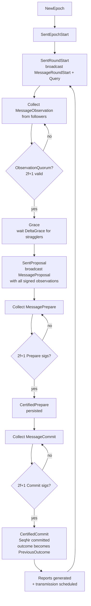
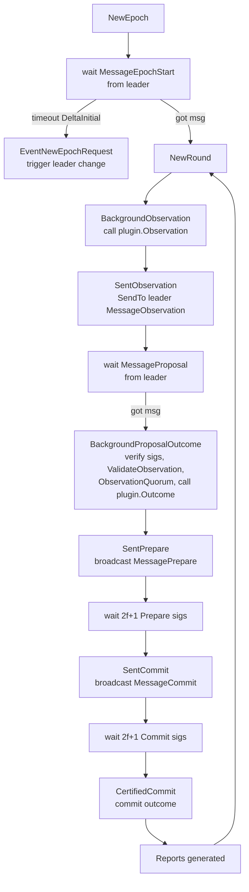
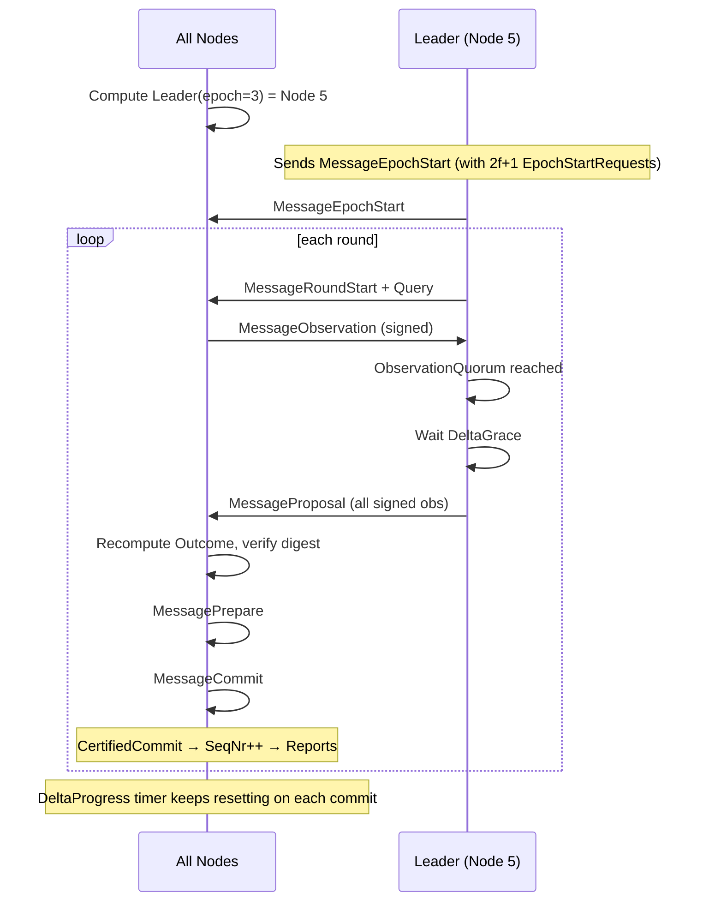
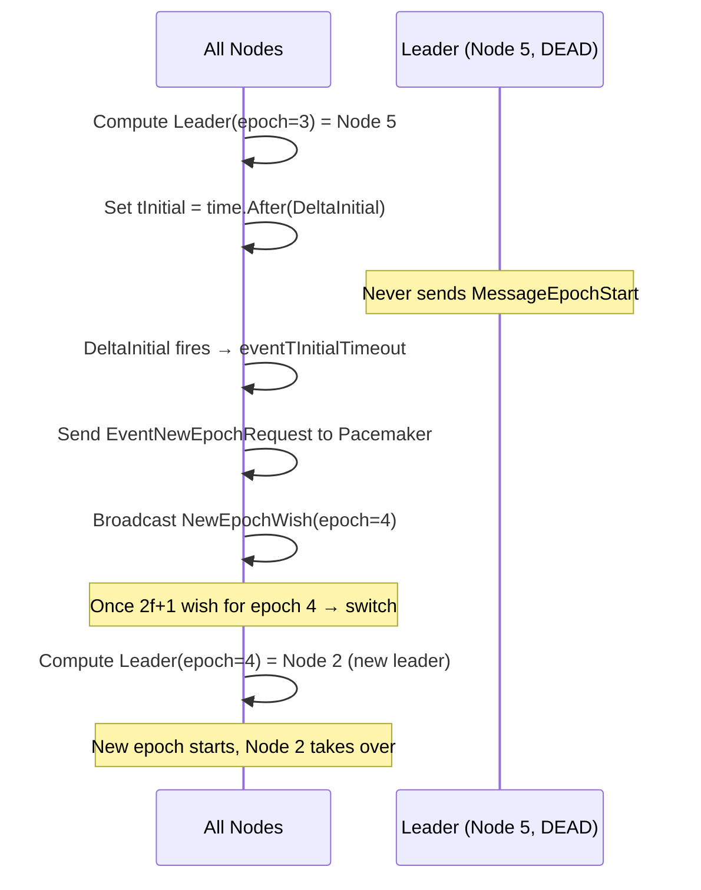
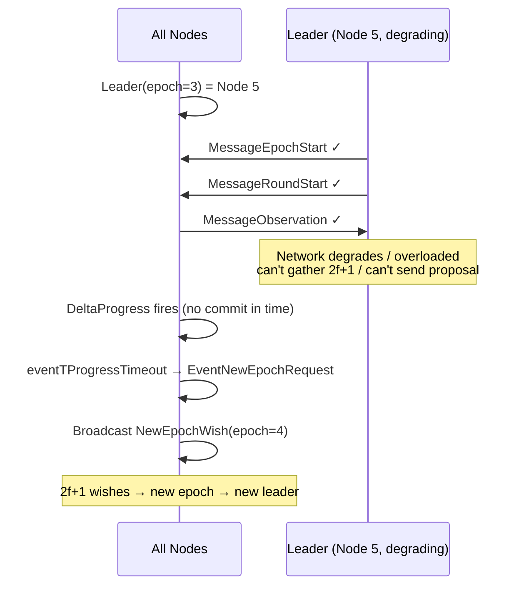
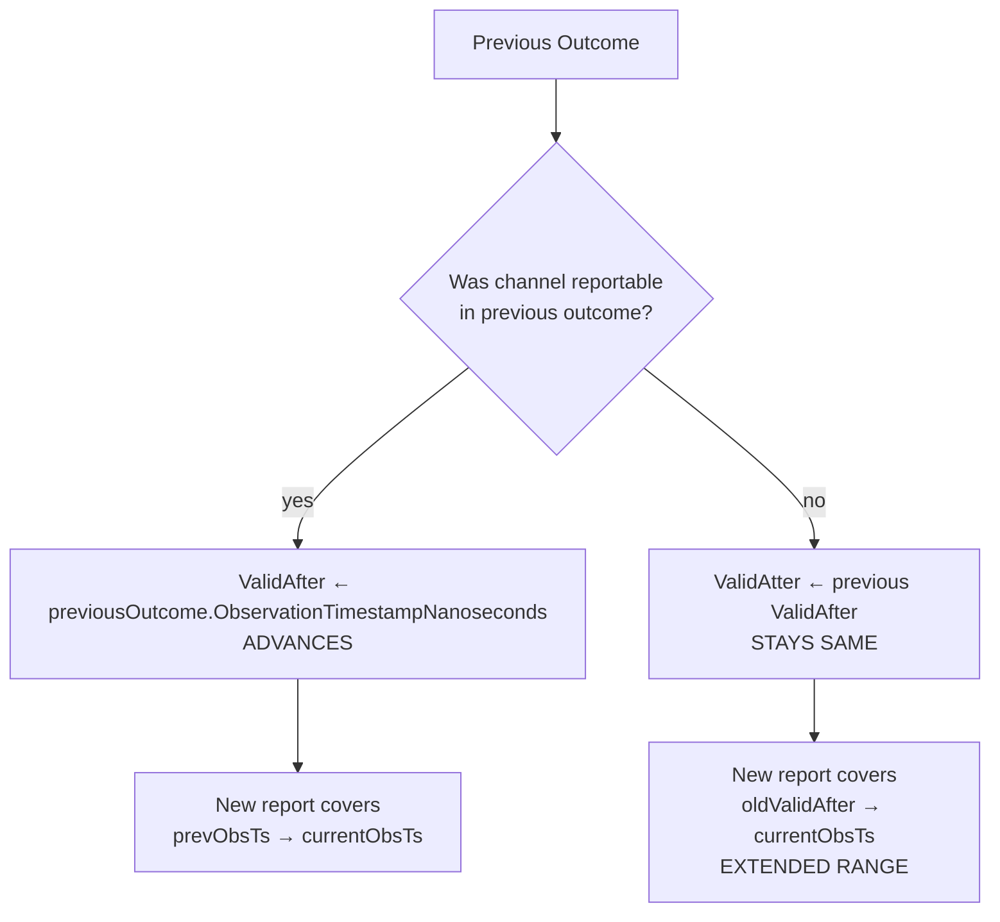
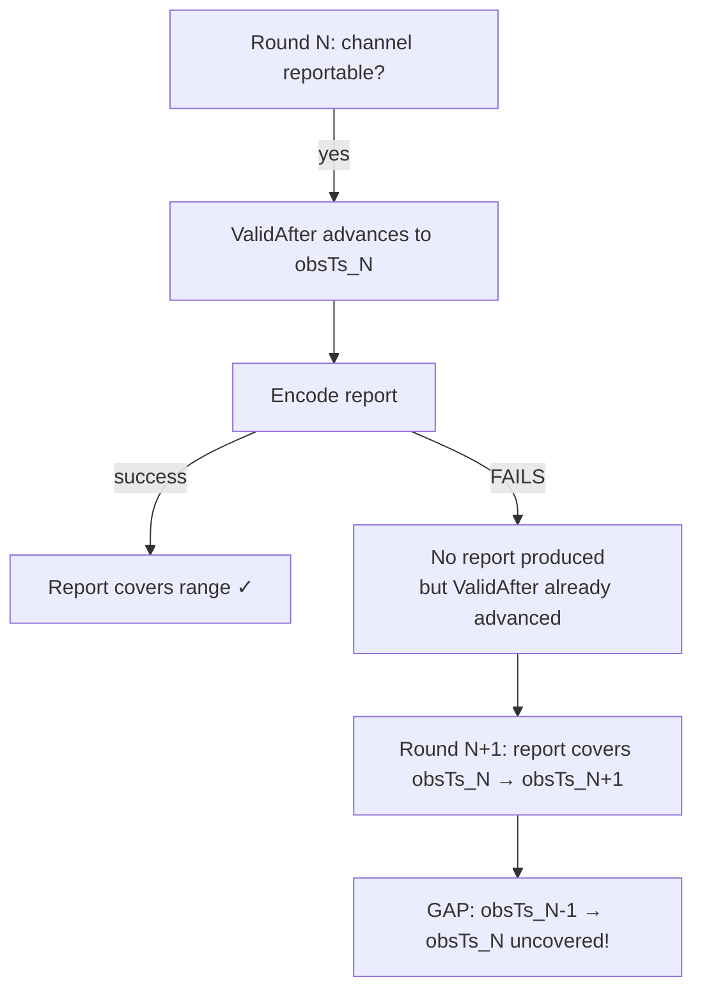
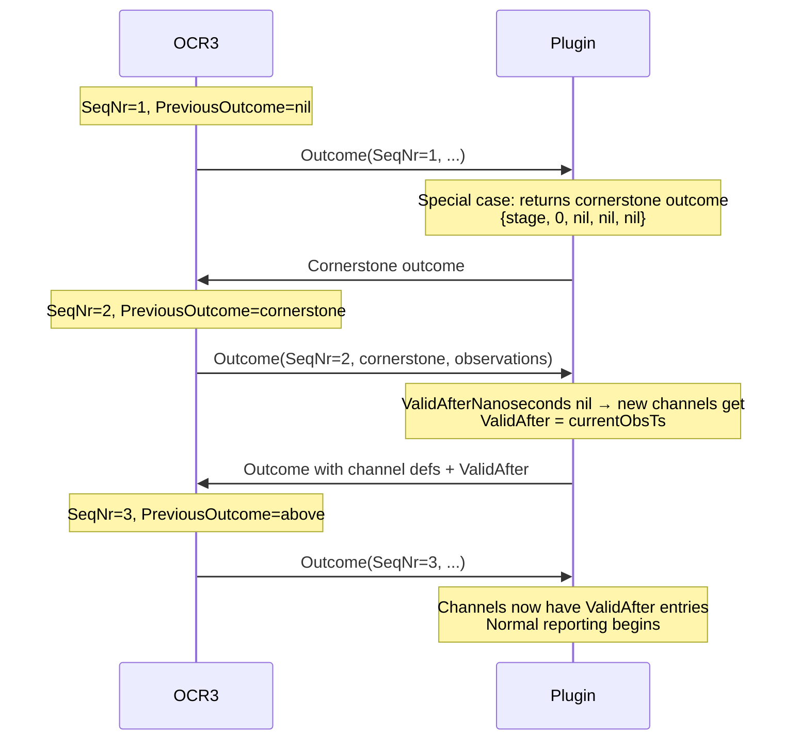

# LLO Protocol Deep Dive: Rounds, Leaders, Outcomes, Reports & Gaps

> A condensed reference for how the LLO (Data Streams) protocol behaves end-to-end:
> OCR3 round lifecycle, leader election & failure handling, the Observation→Outcome→Report
> pipeline, and what produces **report gaps** vs **large report ranges**.
> Includes signals for diagnosing healthy vs unhealthy DONs.

---

## 1. The Two Layers

The system is two cooperating layers. Confusing them is the #1 source of misunderstanding.

| Layer | Owned by | Responsibility | State |
|---|---|---|---|
| **OCR3 protocol** | libocr | Leader election, rounds, epochs, consensus (Prepare/Commit), transmission scheduling | `SeqNr`, `Epoch`, `PreviousOutcome`, leader |
| **LLO plugin** | `llo/v30` | Application logic: what to observe, how to aggregate, when a channel is reportable, how to encode reports | `ValidAfterNanoseconds`, `ChannelDefinitions`, `StreamAggregates` (all carried *inside* the outcome) |

**Critical invariant:** the LLO plugin is **stateless** w.r.t. the outcome chain. It receives `outctx.PreviousOutcome` from OCR3 and trusts that it is the last committed outcome (`SeqNr-1`). Failed rounds never reach the plugin.

---

## 2. OCR3 Round Lifecycle (Observation → Outcome → Report)

A *round* = one `SeqNr`. A round succeeds when it reaches **Certified Commit** (2f+1 commit signatures). Only then does `SeqNr` increment and the outcome become the new `PreviousOutcome`.

### 2.1 Phases (leader side)



### 2.2 Phases (follower side)



### 2.3 Where the LLO plugin hooks in

| OCR3 phase | LLO plugin call | What it does |
|---|---|---|
| Round start (leader) | `Query()` | Returns `nil` (LLO doesn't need a query) |
| Observation (all nodes) | `Observation()` | Fetches stream values from `DataSource`, stamps `time.Now().UnixNano()` |
| Proposal (followers) | `ValidateObservation()` per obs | Checks observation well-formedness |
| Proposal (followers) | `ObservationQuorum()` | `2f+1` valid observations (default quorum) |
| Proposal (followers) | `Outcome()` | **The big one**: medianize timestamps, aggregate streams, update `ValidAfterNanoseconds`, carry channel defs |
| After commit | `Reports()` | For each reportable channel, encode a report |
| Transmission | `ShouldAcceptAttestedReport` / `ShouldTransmitAcceptedReport` | Both return `true` (transmit everything) |

> **Performance note:** `Outcome()` runs on *every node* during the proposal phase (each follower computes it independently to verify the leader's proposal). It's pure and must be fast. The leader does **not** send the outcome in `MessageProposal` — it sends the signed observations, and each follower recomputes the outcome to check the digest matches.

---

## 3. Leader Election & Failure Handling

### 3.1 Leader selection is deterministic — no handshake

```go
func Leader(epoch uint64, n int, key [16]byte) commontypes.OracleID {
    // HMAC-based permutation of oracle IDs for this epoch
    // Every node computes this locally. No message from the leader is needed.
}
```

All nodes independently compute `Leader(epoch, n, LeaderSelectionKey)`. **A dead node can be elected leader.** There is no "I accept leadership" confirmation. The protocol is *optimistic* — it assumes the leader is alive and relies on timeouts to detect otherwise.

### 3.2 Happy path: leader is alive and fast



### 3.2.1 Happy path: detailed per-phase message flow

This expands one round into every OCR3 message and the LLO plugin call at each step.
Assumes `N=4, F=1` (so quorum = `2f+1 = 3`).

```mermaid
sequenceDiagram
    autonumber
    participant L as Leader (Node 5)
    participant F1 as Follower N1
    participant F2 as Follower N2
    participant F3 as Follower N3
    participant P as LLO Plugin

    Note over L,F3: ── EPOCH START ──

    L->>F1: MessageEpochStartRequest
    L->>F2: MessageEpochStartRequest
    L->>F3: MessageEpochStartRequest
    Note over L: Collects 2f+1=3 EpochStartRequests<br/>with valid HighestCertified proofs
    L->>F1: MessageEpochStart (EpochStartProof + sig)
    L->>F2: MessageEpochStart
    L->>F3: MessageEpochStart
    Note over F1,F3: Followers verify EpochStartProof<br/>phase → NewRound

    Note over L,F3: ── ROUND (SeqNr=k) ──

    Note over L: phase → SentRoundStart<br/>sets tRound = After(DeltaRound)
    L->>F1: MessageRoundStart(epoch, seqNr, Query)
    L->>F2: MessageRoundStart
    L->>F3: MessageRoundStart

    Note over F1: phase → BackgroundObservation
    F1->>P: Observation(ctx, outctx, query)
    F2->>P: Observation(ctx, outctx, query)
    F3->>P: Observation(ctx, outctx, query)
    Note over P: DataSource.Observe() → stream values<br/>stamp time.Now().UnixNano()
    P-->>F1: encoded Observation
    P-->>F2: encoded Observation
    P-->>F3: encoded Observation

    Note over F1: phase → SentObservation
    F1->>L: MessageObservation (SignedObservation)
    F2->>L: MessageObservation
    F3->>L: MessageObservation

    Note over L: Verify each SignedObservation sig<br/>call plugin.ValidateObservation per obs
    L->>P: ValidateObservation (per obs)
    Note over L: ObservationQuorum? (2f+1=3 valid)
    Note over L: YES → phase → Grace<br/>set tGrace = After(DeltaGrace)

    Note over L: tGrace fires → phase → SentProposal
    L->>F1: MessageProposal (AttributedSignedObservations)
    L->>F2: MessageProposal
    L->>F3: MessageProposal
    Note over L: Leader does NOT send outcome,<br/>only the signed observations

    Note over F1: phase → BackgroundProposalOutcome
    F1->>P: ValidateObservation (per obs in proposal)
    F2->>P: ValidateObservation
    F3->>P: ValidateObservation
    F1->>P: ObservationQuorum(aos)
    F2->>P: ObservationQuorum(aos)
    F3->>P: ObservationQuorum(aos)
    Note over F1,F3: Each follower independently calls:
    F1->>P: Outcome(ctx, outctx, query, aos)
    F2->>P: Outcome(ctx, outctx, query, aos)
    F3->>P: Outcome(ctx, outctx, query, aos)
    Note over P: medianize timestamps<br/>aggregate streams (median/quote)<br/>update ValidAfterNanoseconds<br/>carry ChannelDefinitions
    P-->>F1: encoded Outcome
    P-->>F2: encoded Outcome
    P-->>F3: encoded Outcome
    Note over F1,F3: Compute OutcomeInputsDigest + OutcomeDigest<br/>Sign Prepare over (inputsDigest, outcomeDigest)

    Note over F1: phase → SentPrepare
    F1->>L: MessagePrepare (PrepareSignature)
    F1->>F2: MessagePrepare
    F1->>F3: MessagePrepare
    F2->>L: MessagePrepare
    F2->>F1: MessagePrepare
    F2->>F3: MessagePrepare
    F3->>L: MessagePrepare
    F3->>F1: MessagePrepare
    F3->>F2: MessagePrepare

    Note over F1: Collect 2f+1=3 valid Prepare sigs<br/>→ CertifiedPrepare (persisted)
    Note over F1: phase → SentCommit<br/>Sign Commit over outcomeDigest
    F1->>L: MessageCommit (CommitSignature)
    F1->>F2: MessageCommit
    F1->>F3: MessageCommit
    F2->>L: MessageCommit
    F2->>F1: MessageCommit
    F2->>F3: MessageCommit
    F3->>L: MessageCommit
    F3->>F1: MessageCommit
    F3->>F2: MessageCommit

    Note over F1: Collect 2f+1=3 valid Commit sigs<br/>→ CertifiedCommit
    Note over L,F3: commit(outcome) → committedSeqNr = seqNr<br/>outcome becomes PreviousOutcome for seqNr+1<br/>SeqNr++ → next round

    Note over L,F3: ── REPORTS ──

    Note over L: Leader calls Reports(seqNr, outcome)
    L->>P: Reports(ctx, seqNr, outcome)
    Note over F1: Followers also call Reports
    F1->>P: Reports(ctx, seqNr, outcome)
    F2->>P: Reports(ctx, seqNr, outcome)
    F3->>P: Reports(ctx, seqNr, outcome)
    Note over P: ReportableChannels() → IsReportable per channel<br/>for each reportable: encode report<br/>emit ReportPlus[] (with ReportInfo)
    P-->>L: []ReportPlus
    P-->>F1: []ReportPlus
    P-->>F2: []ReportPlus
    P-->>F3: []ReportPlus

    Note over L,F3: ── TRANSMISSION ──

    Note over L,F3: ShouldAcceptAttestedReport → true<br/>ShouldTransmitAcceptedReport → true
    Note over L,F3: Per TransmissionSchedule:<br/>oracles transmit in stages with delays<br/>first successful transmit wins
    L->>L: Transmit report (if scheduled)
    F1->>F1: Transmit report (if scheduled)
    Note over L,F3: LLO transmitter → Mercury server (gRPC)<br/>or CRE transmitter → on-chain
```



**Key takeaways from the happy path:**

1. **Epoch start is a one-time handshake** — leader proves it has 2f+1 `EpochStartRequest`s with valid `HighestCertified` proofs. Followers won't accept round messages until they've seen a valid `MessageEpochStart`.
2. **Observations go leader-bound only** (`SendTo`), not broadcast. The leader collects and re-distributes them in the proposal.
3. **The leader never sends the outcome** — it sends signed observations in `MessageProposal`. Every follower recomputes `Outcome()` independently and signs a `Prepare` over the resulting digest. This is how consensus on the outcome is reached *without* the leader dictating it.
4. **Prepare and Commit are broadcast** (all-to-all). The leader is just another node here — it also sends Prepare/Commit.
5. **`Outcome()` runs N times per round** (once per node), not once. This is the main CPU cost and why it must be pure and fast.
6. **Reports run on every node** after commit, but only scheduled transmitters actually send to Mercury/on-chain.
7. **`DeltaGrace` is the minimum round duration** under a correct leader — the leader always waits for stragglers after reaching quorum.

### 3.3 Failure path A: leader is dead at epoch start



**Cost:** `DeltaInitial` of dead time. No rounds produced. Next successful round's report range spans this gap.

### 3.4 Failure path B: leader starts, then can't complete rounds



**Cost:** `DeltaProgress` of dead time (can be multiple rounds worth if leader was partially working). The `RMax` cap also forces an epoch change after too many rounds even with a working leader (rotates leadership).

### 3.5 Why no liveness pre-check?

- A node can die *mid-epoch* — pre-checks can't prevent that
- Pre-checks add latency on the happy path
- Timeouts handle all failure modes uniformly (dead, slow, partitioned, Byzantine)
- Deterministic `Leader()` avoids a meta-election problem

---

## 4. The Outcome: Where Report Ranges Are Born

### 4.1 Outcome structure

```
Outcome {
    LifeCycleStage                  // staging | production | retired
    ObservationTimestampNanoseconds // median of all observation timestamps
    ChannelDefinitions              // set of channels
    ValidAfterNanoseconds           // per-channel: "report covers [ValidAfter, ObsTs]"
    StreamAggregates                // per-stream/aggregator: medianized values
}
```

### 4.2 How `ValidAfterNanoseconds` advances

This is the **single most important mechanism** for understanding gaps vs ranges.



**Reportable** = passes `IsReportable()`:
- Not retired, not tombstoned
- Has `ValidAfterNanoseconds` entry
- `obsTs >= validAfter + minReportInterval` (timing)
- For seconds-resolution: `validAfterSeconds < obsTsSeconds` (no overlap)
- If `DisableNilStreamValues=true`: all stream aggregates present (non-nil)

### 4.3 The golden rule

> **`ValidAfter` only advances when the previous outcome's channel was reportable.** If it wasn't reportable, `ValidAfter` stays put, and the next report covers a *longer* range. This is by design — it prevents gaps.

---

## 5. Gaps vs Large Ranges

### 5.1 Definitions

- **Report range** = `[ValidAfterNanoseconds, ObservationTimestampNanoseconds]`
- **Large range** = a single report covering a long time span (e.g. 30s). *Contiguous, no missing data.*
- **Gap** = a time range with *no report at all*. E.g. reports `[1,2], [3,3], [4,5]` then `[7,7]` — `[6,6]` is missing.

### 5.2 What causes LARGE RANGES (not gaps)

All of these skip rounds entirely. `ValidAfter` doesn't move. Next success covers the whole gap.

| Cause | Mechanism | Cost |
|---|---|---|
| Failed round (no consensus) | `SeqNr` doesn't advance, no outcome | Time until next successful round |
| Dead leader (epoch start) | `DeltaInitial` timeout → epoch change | `DeltaInitial` |
| Slow/degraded leader | `DeltaProgress` timeout → epoch change | `DeltaProgress` |
| Leader rotation (`RMax`) | Forced epoch change after N rounds | One epoch transition |
| Slow `DataSource.Observe` | Observation timestamp captured late | Round takes longer |
| Network latency to leader | Observations arrive slowly | Round takes longer |
| DON-wide overload | All nodes slow | Consistently larger ranges |

### 5.3 What causes actual GAPS

A gap requires **two conditions simultaneously**:
1. Channel **passes `IsReportable`** → `ValidAfter` advances to `previousObsTs`
2. Report is **silently dropped at encode** → no report covers `[prevObsTs, currentObsTs]`



**Encode-drop failure modes:**
- `DisableNilStreamValues=false` + nil stream value → `encodeReport` fails on `ErrNilStreamValue`
- Report codec error (e.g. bid/mid/ask validation failure in EVM codecs)
- Missing codec for report format

> **`DisableNilStreamValues=true` prevents gaps from nil stream values** by making the channel unreportable at `IsReportable` time (so `ValidAfter` doesn't advance). But it does **not** prevent gaps from codec/validation failures at encode time.

### 5.4 Quick reference table

| Scenario | `IsReportable` | Report produced? | `ValidAfter` | Result |
|---|---|---|---|---|
| Healthy round | ✓ | ✓ | Advances | Normal range |
| Nil stream, `DisableNilStreamValues=true` | ✗ (blocked) | ✗ | Stays | **Extended range** (no gap) |
| Nil stream, `DisableNilStreamValues=false` | ✓ | ✗ (encode fails) | Advances | **GAP** |
| Codec/validation error at encode | ✓ | ✗ (encode fails) | Advances | **GAP** |
| Failed round (no consensus) | n/a | n/a | n/a (no outcome) | **Large range** on next success |
| Dead leader | n/a | n/a | n/a | **Large range** on next success |

---

## 6. LLO-Specific: When Medianization Fails

A channel needs stream values from `StreamAggregates`. Aggregation fails when fewer than `f+1` observations have a usable value for that stream.

```go
// MedianAggregator
if len(observations) <= f {
    return nil, fmt.Errorf("not enough observations to calculate median, expected at least f+1, got %d", len(observations))
}
```

When aggregation fails:
- The stream ID is **missing** from `StreamAggregates` (not nil, just absent)
- If `DisableNilStreamValues=true`: channel fails `IsReportable` → `ValidAfter` doesn't advance → **extended range, no gap**
- If `DisableNilStreamValues=false`: channel may pass `IsReportable` but `encodeReport` fails on nil → **gap**

For `TimestampedStreamValue`, failed aggregation **carries forward** the previous value (monotonicity guarantee) — so the channel may still be reportable with a stale value.

---

## 7. Protocol Startup & Outcome Chain



**Key points:**
- `SeqNr=1` always returns the empty cornerstone outcome (early return, ignores `PreviousOutcome`)
- `SeqNr=2` is where channels get initialized: `ValidAfter = outcome.ObservationTimestampNanoseconds`
- `SeqNr=3+` is normal operation
- Failed rounds don't increment `SeqNr` — the chain is unbroken

---

## 8. DON Health Signals

### 8.1 Healthy DON signals

| Signal | Where to look | Healthy value |
|---|---|---|
| Report cadence | Report telemetry / on-chain | Consistent, matches `minReportInterval` / seconds resolution |
| Report range span | `obsTs - validAfter` per report | ~1s for seconds-resolution (minimum); stable |
| Epoch churn | libocr logs `EpochStarted`, metrics `ocr3_epoch` | Low; epochs last many rounds |
| Round success rate | libocr metrics | High; few `TProgress`/`TInitial` timeouts |
| `SeqNr` increments | Outcome telemetry | Monotonic, regular |
| Observation count per round | Outcome telemetry | `2f+1` or close to `N` |
| Transmit queue depth | `llo_mercurytransmitter_transmit_queue_load` | Low, not growing |
| Consecutive transmit errors | `llo_mercurytransmitter_concurrent_transmit_gauge` | 0 |

### 8.2 Unhealthy DON signals

| Signal | Likely cause | Impact |
|---|---|---|
| Report range span suddenly jumps to `~DeltaProgress` | Dead/slow leader → epoch change | Large range (not a gap) |
| Report range span jumps to `~DeltaInitial` | Leader dead at epoch start | Large range |
| Epoch changing every few rounds | Leader keeps failing / `RMax` too low / network partition | Frequent large ranges |
| `TProgress fired` logs frequent | Leader can't complete rounds | Large ranges |
| `TInitial fired` logs frequent | Leaders dying at start | Large ranges |
| `ObservationQuorum returned false despite n-f` logs | Plugin bug or widespread observation failures | Rounds fail → large ranges |
| Gaps in report `ValidAfter` sequence | Encode-time drops (codec errors, nil values with `DisableNilStreamValues=false`) | **Actual gaps** |
| `dropping MessageObservation carrying invalid` logs | Byzantine/misbehaving node | Reduced observation count |
| One node's observations consistently dropped | That node is faulty (bad data, bad sigs, slow) | Identify & remove |
| Transmit queue > 50% full | Mercury server unreachable / slow | Reports delayed (not gaps in protocol, but delivery lag) |
| `concurrent_transmit_gauge` at max | Transmit threads saturated | Delivery bottleneck |

### 8.3 Diagnosing a bad node

1. **Check if a specific node is never leader but others rotate normally** → node may be partitioned or down (not receiving `NewEpochWish` messages)
2. **Check if a specific node's observations are always dropped** (`dropping MessageObservation` logs from leader) → node sending invalid/garbage data
3. **Check if epochs die when a specific node is leader** → that node can't lead (overloaded, slow disk, bad network)
4. **Check `includedObservationsTotal` metric per node** → a node consistently not included in proposals is being excluded by leaders
5. **Check report telemetry `StreamValues`** → if one node's values are consistently outliers, it may have a bad data source

### 8.4 Diagnosing gaps vs large ranges

```
Look at sequence of (ValidAfter, ObservationTimestamp) pairs:

Healthy:  [0,1] [1,2] [2,3] [3,4]  ← each range contiguous with next
Large range: [0,1] [1,30] [30,31]  ← [1,30] spans a failure period, but NO gap
GAP:       [0,1] [1,2] [4,5]       ← [2,4] missing entirely = GAP
```

- **Large range**: `ValidAfter_N == ObservationTimestamp_N-1` (contiguous) but span is large → round/epoch failure, expected behavior
- **Gap**: `ValidAfter_N > ObservationTimestamp_N-1` → encode-time drop, investigate codec errors / nil stream values

---

## 9. Config Parameters That Matter

| Parameter | Effect | Tuning notes |
|---|---|---|
| `DeltaRound` | Min time between round starts | Lower bound only; actual rounds may take longer |
| `DeltaGrace` | Leader waits for stragglers after quorum | Rounds always take ≥ `DeltaGrace` under correct leaders |
| `DeltaProgress` | Max time without a commit before epoch change | Too short → premature epoch churn (liveness failure) |
| `DeltaInitial` | Max time without `MessageEpochStart` before epoch change | Too short → premature epoch churn |
| `RMax` | Max rounds per epoch | Forces leader rotation; too low → unnecessary churn |
| `DefaultMinReportIntervalNanoseconds` | Min time between reports per channel | Enforced in `IsReportable` |
| `DisableNilStreamValues` (per channel) | Blocks reportability on nil stream values | `true` = gap prevention for nil values |

---

## 10. Summary Cheat Sheet

```
FAILED ROUND / DEAD LEADER / SLOW DON
  → SeqNr doesn't advance
  → PreviousOutcome carries forward unchanged
  → Next success: ValidAfter unchanged, obsTs = now
  → ONE BIG RANGE (contiguous, no gap)

NIL STREAM VALUE + DisableNilStreamValues=true
  → IsReportable fails
  → ValidAfter doesn't advance
  → EXTENDED RANGE (no gap)

NIL STREAM VALUE + DisableNilStreamValues=false
  → IsReportable passes
  → ValidAfter advances
  → encodeReport fails on nil
  → GAP

CODEC/VALIDATION ERROR AT ENCODE
  → IsReportable passes (all values present)
  → ValidAfter advances
  → encodeReport fails
  → GAP

HEALTHY DON
  → Consistent report cadence
  → Range spans ~minReportInterval (or 1s for seconds-res)
  → Low epoch churn
  → 2f+1 observations per round

UNHEALTHY DON
  → Range span jumps ≈ DeltaProgress/DeltaInitial
  → Frequent epoch changes
  → TProgress/TInitial timeouts in logs
  → Gaps = encode drops (check codec errors, nil values)
```
